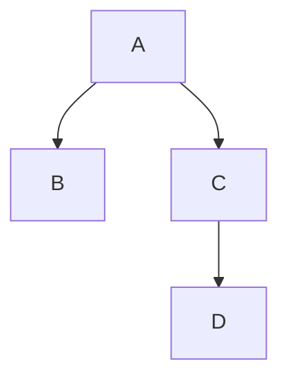

 # Documenting your work

> Author: Name Surname (<n.surname@example.com>)

Source script for this document: [link](https://gist.github.com/Sh3b0/496d5fb4df4fcaa7a045c1e7046ccc92)

## Tools

Tools for writing documents:

- **Word Processors** ([MSWord](https://www.microsoft.com/en-ww/microsoft-365/word), [LibreOffice](https://www.libreoffice.org/download/download-libreoffice/), [Pages](https://www.apple.com/pages/), [Google Docs](https://docs.google.com/))
    - WYSIWYG tools for general use and stylish documents.
    - Not recommended for technical documentation and source code.
    - Portability not guaranteed unless document is converted to PDF.
- **LaTeX environments** ([Overleaf](http://overleaf.com/), [TeX Studio](https://www.texstudio.org/), [TexMaker](https://www.xm1math.net/texmaker/))
    - Recommended for research, technical diagrams. and mathematical formulas. 
- **Markdown Editors** ([HackMD](https://hackmd.io/), [Typora](https://typora.io/), [Obsidian](https://obsidian.md/)).
    - Recommended for technical documentation with embedded source code.
    - The industry standard for open-source software (e.g., on GitHub)
    - Balances between ease of use and powerfullness.
- **Interactive notebooks** ([Jupyter](https://jupyter.org/), [Google Colab](https://colab.research.google.com/))
    - Recommended for data science projects and proof-of-concept illustrations.
    - Incorporates MarkDown, LaTeX, and runnable blocks of source code (typically Python and BASH).

## Approach for Reports

A good report resembles a tutorial ready to be posted on your blog.

1. Include the necessary steps you took to accomplish the task.

   ```c++
   #include <iostream>
   
   int main() {
       std::cout << "Hello World!";
       return 0;
   }
   ```

2. Prove that you accomplished the task by embedding a unique screenshot, GIF, or a video with results.

   > You can store the image locally and use a relative link or upload it to some service like [Imgur](https://imgur.com/upload) or GitHubUserContent and include a direct URL.

    

3. Be brief and concise, a screenshot for every single step is unnecessary.


## Checklist

- [x] The report includes author name and related info on the top
- [x] The report follows a logical structure and clear steps.
- [x] The report is exported to a convenient format (PDF, HTML, or MD).
- [x] Related artifacts (source code, binary files, etc.) are included.
- [ ] The file has a meaningful name with a standard extension (e.g., `zip,pdf,html,md` and not a software-specific one `rar,7z`).


## Extra ==Features== for Nerds

### :chart: <u>Tables</u>

| Language | Awesomeness |
| -------- | ----------- |
| Python   | Yes         |
| Java     | No          |

### :sparkles: Math^*^~*~

$$
x=\frac{-b\pm\sqrt{b^2-4ac}}{2a}
$$

### :gear: Mermaid Diagrams



### :computer: HTML/CSS/JS

<details>
<summary>Expandable Item</summary>
Lorem ipsum dolor sit amet, consectetur adipiscing elit, sed do eiusmod tempor incididunt ut labore et dolore magna aliqua. Ut enim ad minim veniam, quis nostrud exercitation ullamco laboris nisi ut aliquip ex ea commodo consequat. Duis aute irure dolor in reprehenderit in voluptate velit esse cillum dolore eu fugiat nulla pariatur. Excepteur sint occaecat cupidatat non proident, sunt in culpa qui officia deserunt mollit anim id est laborum. 
</details>
